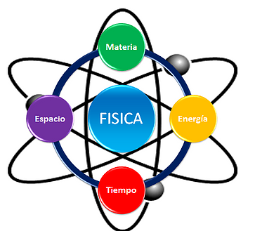

Listado de materias por aprobar
==============================
## Física
La física es una de las disciplinas académicas más antiguas, cuyas raíces se remontan a los inicios de la civilización, cuando el hombre empezó a tratar de entender las fuerzas que regían el mundo a su alrededor.

Se trata de una disciplina tanto teórica (describe las leyes del universo) como experimental (pone en práctica de hipótesis respecto a dichas leyes), y se adhiere al modelo de comprobación y legitimación impulsado por el método científico. Es una de las ciencias fundamentales o centrales que existen, y dentro de su campo de estudio convergen a menudo la química, la biología y la electrónica, entre otras.

### Importancia
Debido a su relación con las ciencias básicas, la física resulta ser una parte muy útil en el desarrollo de programas para computadores, ya que estos también tienen un orden y sentido lógico con el uso de las matemáticas 

## Ingeníeria de requisitos
El proceso de recopilar, analizar y verificar las necesidades del cliente para un sistema de software es llamado Ingeniería de Requerimientos. La meta de la ingeniería de requerimientos es entregar una especificación de requerimientos de software correcta y completa. La ingeniería de requerimientos apunta a mejorar la forma en que comprendemos y definimos sistemas de software
complejos. 

### Importancia
Es una de las materias fundamentales para aprender a desarrollar software profesional, esta nos guia acerca de cuales deberian ser las prioridades al desear trabajar en un software, como serian las metodologias que podriamos usar dependiendo del caso, que deberiamos interpretar al tener ciertas caracteristicas, como se deberia desempeñar el grupo de trabajo en dicho software entre una que otra más

## Fundamentos de redes
Una red es un sistema formado por dos o más computadoras (grupo de nodos) conectadas entre sí mediante un medio físico o inalámbrico y permiten compartir recursos e información. La información por compartir suele consistir en archivos y datos. Los recursos son los dispositivos o las áreas de almacenamiento de datos de una computadora. Para poder formar una red se requieren elementos: hardware, software y protocolos.

### Importancia
En nuestro mundo actual las redes son algo fundamental de nuestra vida cotidiana, resulta indispensable para esta carrera aprender su definición, para que sirve, como funcionan, cuales son las caracteristicas que las diferencian, entre muchas otras cosas más.
